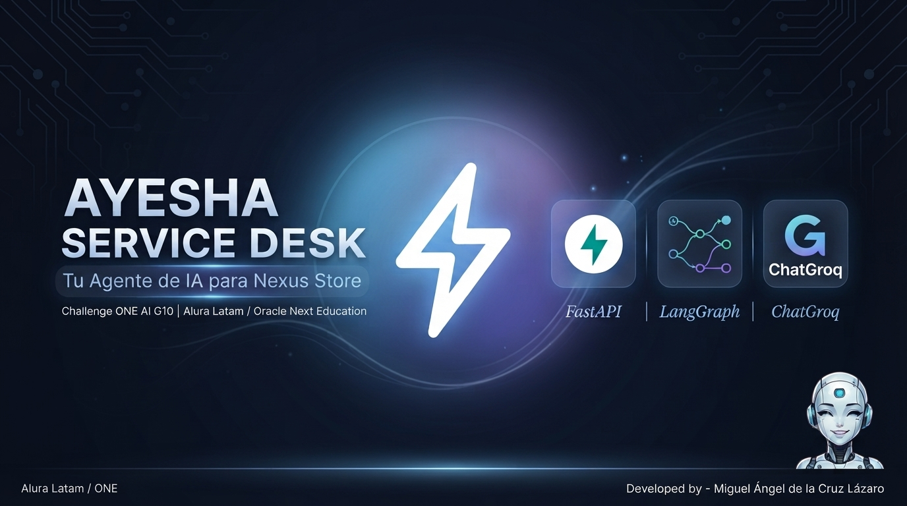
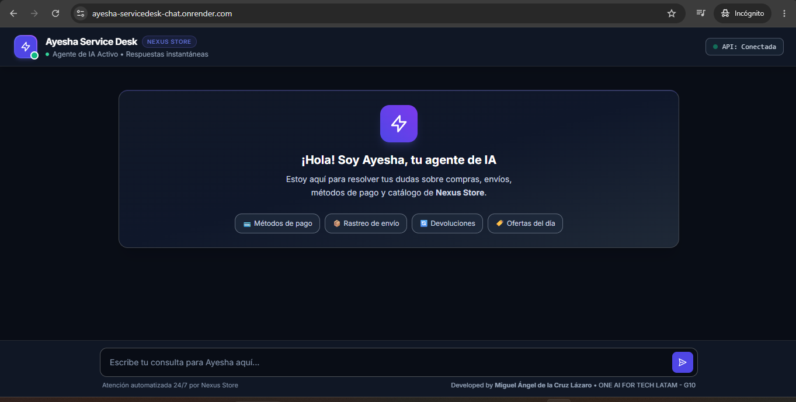
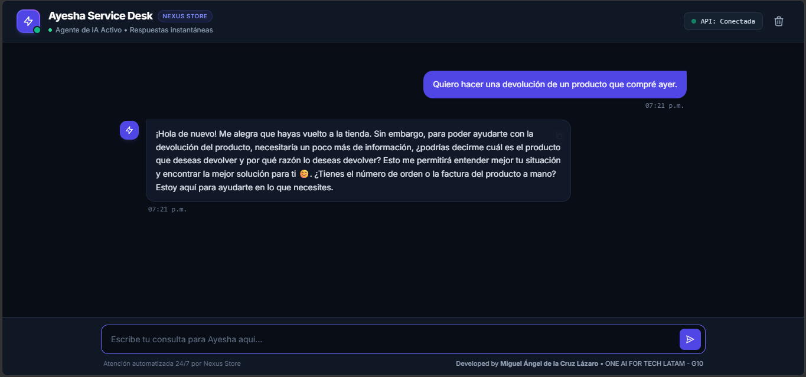
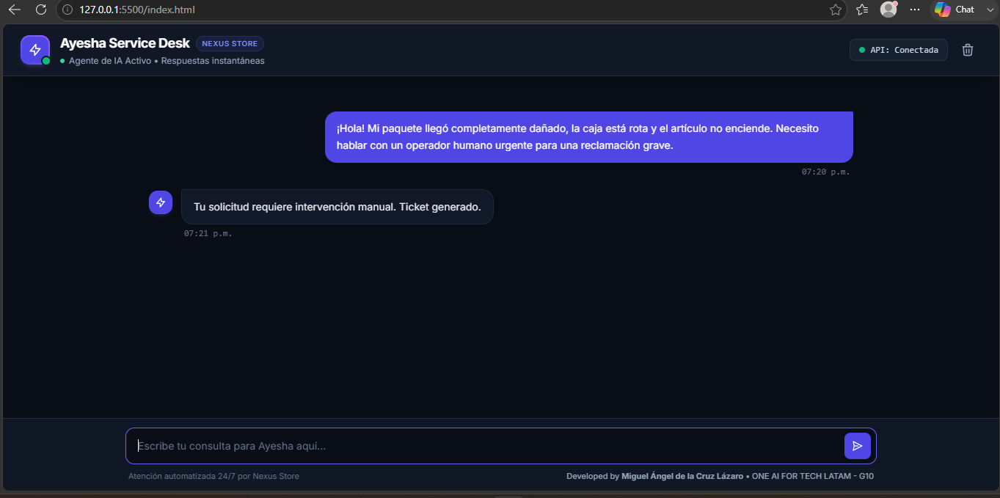

<p align="center">
  
</p>

### Challenge Alura Agente: Service Desk & E-commerce AI ###

---

<p align="center">
  
  
  
  
  
  
</p>

Agente de Inteligencia Artificial conversacional especializado en triaje inteligente, atención al cliente y recuperación automatizada de información (RAG) para la plataforma de comercio electrónico **Nexus Store**.

---
* **🌐 Despliegue en Vivo (Frontend):** [Probar Aplicación Web en Render](https://ayesha-servicedesk-chat.onrender.com)
* **⚡ API Base (Railway):** [Ver Servicio en Railway](https://ia-agent-e-commerce-production.up.railway.app)
* **💬 Endpoint del Chat (API):** [Probar Endpoint `/chat`](https://ia-agent-e-commerce-production.up.railway.app/chat)
* **💻 Repositorio del Frontend (HTML/Tailwind/JS):** [Ver código en GitHub](https://github.com/Miguel-Dark/nexus-store-chat) 
---

## 📹 Demostraciones del Proyecto en Video
* **▶️ Demostración General de Agente (Botones de Acceso Rápido):** [Ver video en YouTube](https://youtu.be/FehVF4PfXEg)
* **▶️ Pruebas del Campo de Texto y Consultas Libres:** [Ver video en YouTube](https://youtu.be/zEmLty-oGag)

---

## 🚀 Arquitectura y Tecnologías
El proyecto está desarrollado con una arquitectura full-stack robusta y moderna:
* **Frontend:** Desarrollado con **HTML5**, diseño ultra responsivo optimizado mediante **Tailwind CSS** y lógica asíncrona en **JavaScript vainilla**. Desplegado en **Render**.
* **Framework Web & Contenedor (Backend):** FastAPI en **Python 3.13-slim**, empaquetado mediante **Docker** para un entorno de producción idéntico y optimizado. Desplegado en la nube de **Railway**.
* **Orquestación del Agente:** LangGraph (Gestión de estados basada en grafos con nodos de triaje, saludos contextuales, auto-resolución y gestión de tickets).
* **Modelo de Lenguaje:** ChatGroq (`llama-3.3-70b-versatile` para procesamiento veloz y de alta precisión).
* **RAG & Procesamiento de Datos:** LangChain, FAISS (Base de datos vectorial local), HuggingFace Embeddings (`all-MiniLM-L6-v2`), PyMuPDF (Carga de guías y políticas en PDF) y Pandas (Procesamiento estructurado de FAQs y catálogo de productos en CSV).
* **Validación de Esquemas:** Pydantic (Validación estricta de entradas, salidas y clasificación estructurada del triaje).

### Flujo Operativo del Sistema
1. **Petición HTTP (`api.py`):** El cliente envía su consulta desde la interfaz web hacia el endpoint `/chat`. FastAPI la procesa de forma concurrente.
2. **Triaje Inteligente (`graph.py`):** Un prompt estructurado con Pydantic clasifica la intención del mensaje en: `SALUDO`, `AUTO_RESOLVER`, `PEDIR_INFO` o `ABRIR_TICKET`.
3. **Recuperación Vectorial RAG (`rag.py`):** Si la consulta es del tipo `AUTO_RESOLVER`, el retriever de FAISS busca en la base de conocimiento local (políticas de reembolso, guías de envío, inventario y preguntas frecuentes).
4. **Síntesis del Agente (Ayesha):** El LLM redacta una respuesta empática, profesional y totalmente apegada a los datos oficiales de la tienda, entregando citaciones y controlando el historial de la conversación.

---

## 💡 Ejemplos de Preguntas y Respuestas del Agente

* **Pregunta (Precios y Stock):** 
  > *"¿Tienen disponible la Laptop Gamer 15.6" RTX 4090 y cuánto cuesta?"*
  * **Respuesta del Agente (Ayesha):** 
    > *"¡Hola! Sí, tenemos disponible la Laptop Gamer 15.6" RTX 4090 perteneciente a la categoría de Tecnología. Su precio en Nexus Store es de \$21,999.00 MXN y cuenta con un stock de 18 unidades listas para ti. 😊✨"*

* **Pregunta (Envíos y Costos):** 
  > *"¿Cuánto cuesta el envío si mi compra es menor a 500 pesos?"*
  * **Respuesta del Agente (Ayesha):** 
    > *"De acuerdo con nuestra guía de envíos, en compras cuyo monto sea menor o igual a \$500 MXN se aplica un costo de envío estándar único de \$99 MXN. ¡Recuerda que tus envíos son totalmente gratuitos en compras superiores a \$500 MXN! ✨"*

* **Pregunta (Políticas de Devolución):** 
  > *"¿Cuál es el plazo límite para devolver un producto si no me gustó?"*
  * **Respuesta del Agente (Ayesha):** 
    > *"Cuentas con un plazo máximo e improrrogable de 30 días naturales a partir de la fecha en que recibiste tu producto para iniciar una solicitud de devolución, siempre y cuando conserve su empaque original y sin señales de uso. 😊"*

---

## 🖼️ Pruebas de Triaje Inteligente & Interfaz en Producción

* **Vista General de la Interfaz Web (Render):**
  <p align="center">
    
  </p>

* **Gestión de Información Incompleta (`PEDIR_INFO`):** Cuando el usuario realiza una consulta ambigua o le faltan datos críticos, el agente detecta la carencia de información y solicita amablemente los detalles necesarios para continuar.
  <p align="center">
    
  </p>

* **Derivación a Soporte Humano (`ABRIR_TICKET`):** Ante reclamaciones complejas, incidencias graves con un pedido o situaciones que escapan de la base de conocimiento automatizada, el triaje genera y deriva un ticket de atención.
  <p align="center">
    
  </p>

---

## 📂 Estructura del Proyecto
* `config.py`: Módulo centralizado para la configuración de credenciales y la inicialización del LLM de Groq.
* `rag.py`: Lógica de carga de documentos de la carpeta `content/`, fragmentación y construcción del Vectorstore FAISS con su retriever.
* `graph.py`: Definición de los nodos del agente, triaje estructurado con Pydantic y las aristas condicionales de LangGraph.
* `api.py`: Punto de entrada principal con configuración de FastAPI, CORS y ejecución del servidor.
* `Dockerfile` & `.dockerignore`: Configuración para la contenerización y despliegue optimizado en la nube (Railway).
* `requirements.txt`: Archivo con el Stack Tecnológico Principal:
  * **Core & API:** `fastapi` (0.115.0), `uvicorn` (0.30.6), `python-dotenv` (1.2.2)
  * **Orquestación & IA:** `langgraph` (1.2.9), `langchain-core`, `langchain-groq` (1.1.3)
  * **RAG & Vectores:** `faiss-cpu` (1.14.3), `langchain-community`, `langchain-text-splitters`, `langchain-huggingface`, `sentence-transformers` (5.6.0)
  * **Procesamiento:** `pymupdf` (1.28.0) para PDFs, `pandas` (3.0.3) para CSVs y datos estructurados.

---

## ⚙️ Instrucciones de Ejecución Local

Sigue estos pasos para clonar y poner en marcha el proyecto en tu entorno local:

### 1. Clonar el Repositorio
```bash
git clone https://github.com/Miguel-Dark/ia-agent-ecommerce.git
cd ia-agent-ecommerce
```

### 2. Crear y Activar un Entorno Virtual
En Windows (CMD / PowerShell):

```python -m venv .venv```

```.venv\Scripts\activate```

## En Mac / Linux:

```python3 -m venv .venv```

```source .venv/bin/activate```

### 3. Instalar Dependencias
```pip install -r requirements.txt```

### 4. Configurar las Variables de Entorno
Crea un archivo ```.env``` en la raíz del proyecto y añade tu llave secreta de Groq:

```GROQ_API_KEY=tu_clave_de_groq_aqui```

### 5. Ejecutar el Servidor con Uvicorn
```uvicorn api:app --reload --host 0.0.0.0 --port 8000```

---

Developed by **Miguel Ángel de la Cruz Lázaro** como parte del desafío final de la especialización de Backend e Inteligencia Artificial de Alura.

---